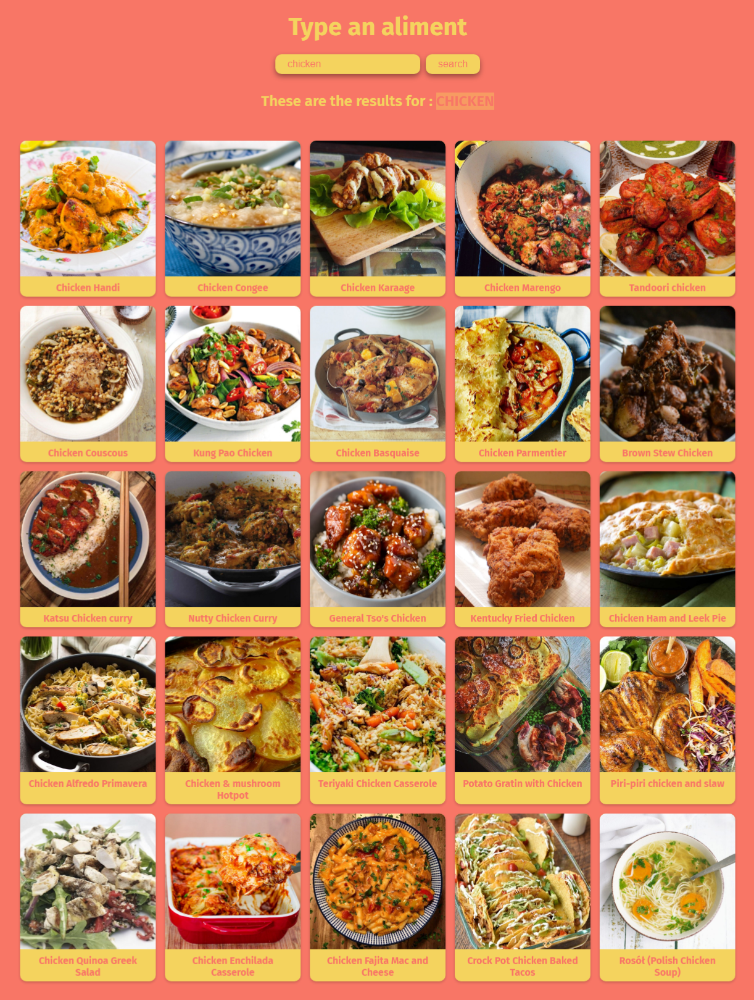
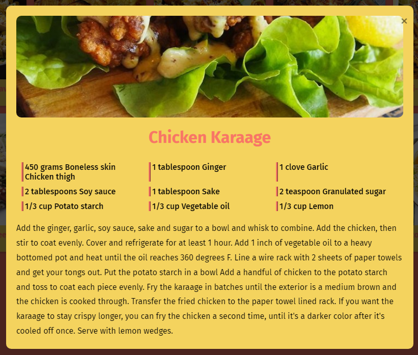

<h1 align="center"> 🍽️ The MealDB 🍽️ </h1>

### 🌐 Demo / Preview



---

### ✏️ **Description**
TheMealDB is my very first project utilizing an API. Using the provided API, this application allows users to search for recipes by entering an ingredient in the search bar.  

Clicking on a recipe opens a detailed modal displaying the recipe along with its ingredients and instructions. This project is a foundational step in understanding how to fetch, display, and manage dynamic data from an external source using JavaScript.

### 💻 **Technologies Used**
- **HTML5**: Minimal structure for the interface.
- **CSS3**: Styling to enhance visual appeal and user experience.
- **JavaScript**: The core technology powering API calls, dynamic rendering, and modal interactions.

### **Key Features** 🚀
🔍 **Ingredient search**: Fetch a list of recipes based on the ingredient entered.

🍳 **Recipe details modal**: View detailed instructions and ingredient lists in an interactive modal.

🔗 **API integration**: First practical implementation of JavaScript for consuming an API.

💡 **Dynamic data rendering**: Learn and apply techniques for fetching and displaying real-time data.

### 🛠️ **Installation & Usage**
1. Clone the repository:
   ```bash
   git clone https://github.com/HUYBERIC/TheMealDB.git
   cd TheMealDB
   ```

2. Open `index.html` in your favorite browser to use the application.

<br>
<br>
<br>

---

<h1 align="center"> 🍽️ The MealDB 🍽️ </h1>

---

### ✏️ **Description**
TheMealDB est mon tout premier projet utilisant une API. À l'aide de cette API imposée, l'application permet de rechercher des recettes en fonction d'un ingrédient tapé dans la barre de recherche.  

En cliquant sur une recette, une fenêtre modale s’ouvre pour afficher les détails de la recette, les ingrédients et les instructions de préparation. Ce projet marque mes premiers pas dans la gestion des données dynamiques et les appels API en JavaScript.

### 💻 **Technologies utilisées**
- **HTML5** : Structure minimale de l’interface.
- **CSS3** : Mise en forme pour améliorer l’aspect visuel et l’expérience utilisateur.
- **JavaScript** : Technologie clé pour les appels API, le rendu dynamique et les interactions modales.

### **Caractéristiques principales** 🚀
🔍 **Recherche par ingrédient** : Récupérez une liste de recettes en fonction de l’ingrédient saisi.

🍳 **Détails des recettes en modale** : Affichez des instructions et des listes d'ingrédients de manière interactive.

🔗 **Intégration API** : Première mise en œuvre pratique de JavaScript pour la consommation d’une API.

💡 **Rendu de données dynamiques** : Apprentissage et application des techniques de récupération et d'affichage des données en temps réel.

### 🛠️ **Installation & Utilisation**
1. Cloner le dépôt :
   ```bash
   git clone https://github.com/HUYBERIC/TheMealDB.git
   cd TheMealDB
   ```

2. Ouvrir `index.html` dans votre navigateur favori pour utiliser l'application.
